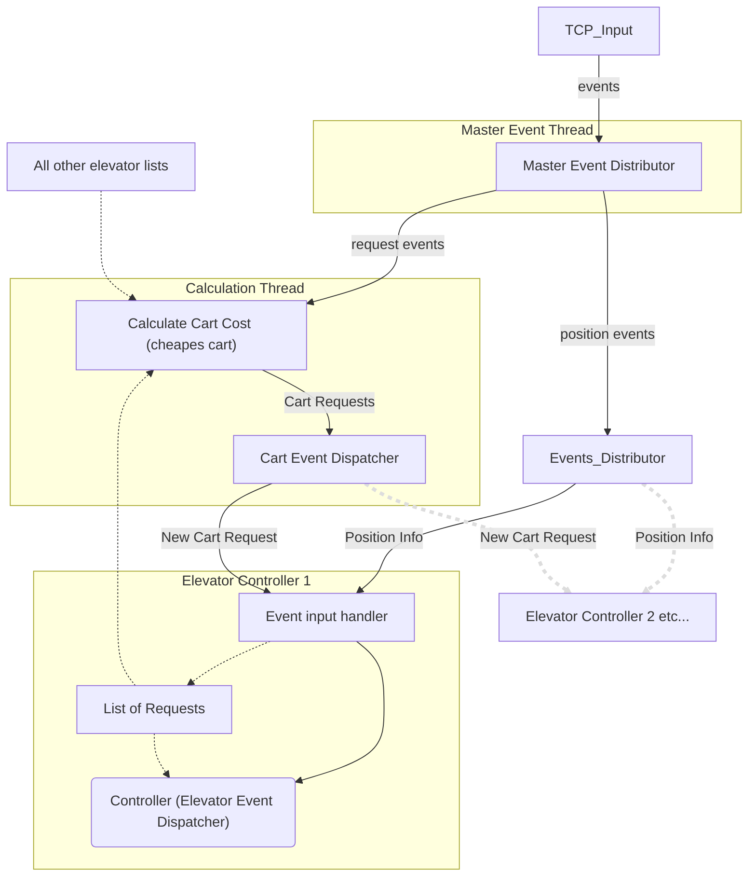

```mermaid
graph TB
    TCP_Input--> |events|master
    master["Master Event Distributor"]--> |request events| Cart_Cost
    subgraph Master Event Thread
    	master
    end
    RequestList-.-> Cart_Cost
    OtherList[All other elevator lists]-.->Cart_Cost
    subgraph Calculation Thread
    	Cart_Cost["Calculate Cart Cost (cheapes cart)"]
    	Cart_Distributor
    end
    Cart_Cost--> |"Cart Requests"| Cart_Distributor
    master--> |position events| Events_Distributor
    Events_Distributor-->|Position Info| E_Input1
    Events_Distributor-->|Position Info| EC2
    EC2[Elevator Controller 2 etc...]
    Cart_Distributor[Cart Event Dispatcher]--> |New Cart Request|E_Input1
    Cart_Distributor--> |New Cart Request|EC2
    subgraph Elevator Controller 1
        E_Input1[Event input handler]-.->RequestList
        E_Input1-->Controller
        RequestList[List of Requests]-.->Controller
        Controller("Controller (Elevator Event Dispatcher)")
    end
    
linkStyle 9 stroke:#ddd,fill:none,stroke-width:4px,stroke-dasharray: 5, 5;
linkStyle 7 stroke:#ddd,fill:none,stroke-width:4px,stroke-dasharray: 5, 5;

```

